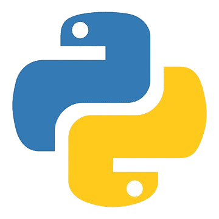
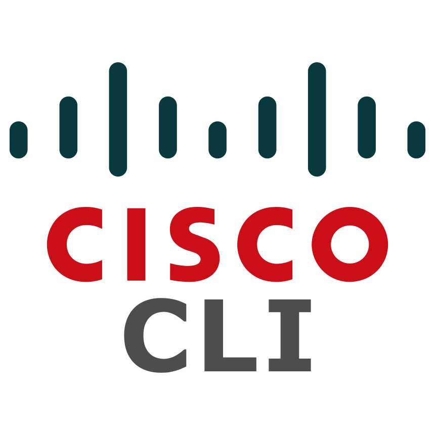
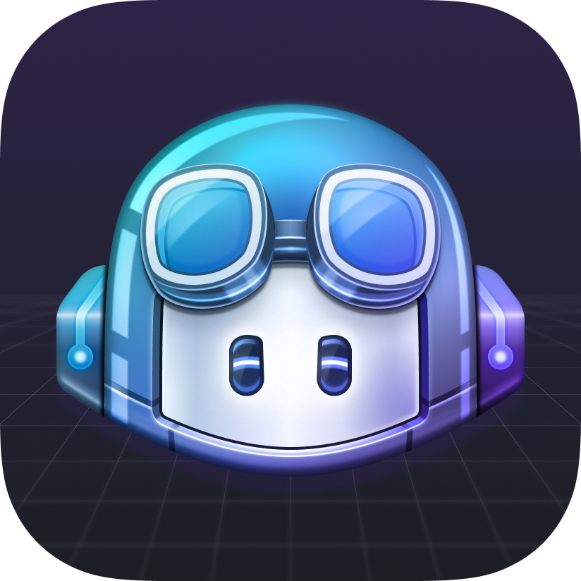
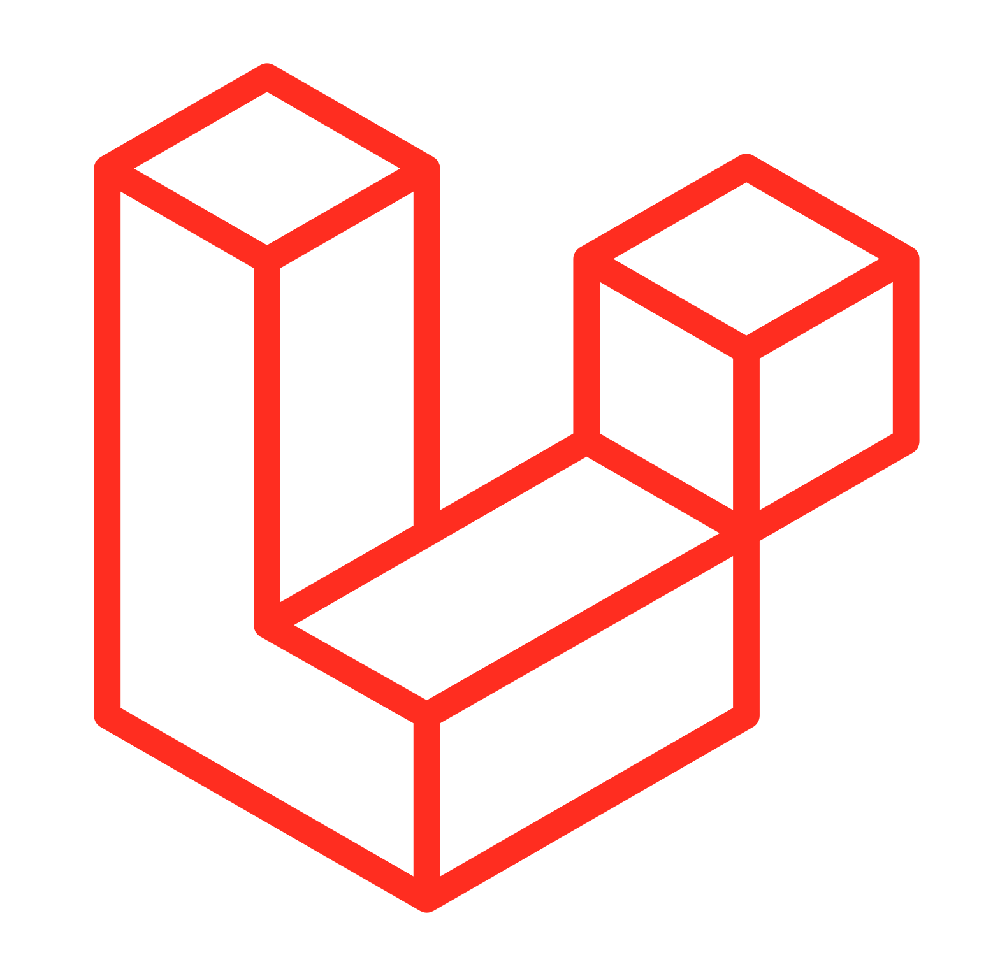
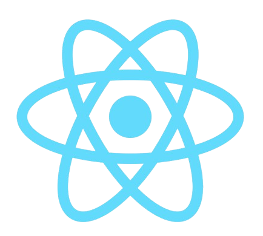

   <h3> 👋🏽 みなさん、こんにちは。I'm Computer Engineering Student - Grad Soon  </h3>
   <h4> reaching my goals and dreams with a beauti vibes </h4>
 
<pre>
  💻 Tech lover 🪐 Astronomy / Physics
  🧑‍💻 Code Linux Cloud Algorithms AI 
  🍃 Nature Minimalism and Chill Vibes
  📖 Anime/Manga 🇯🇵🗼Japanese Culture 🎧 Music 🎮 Adventure Games
  🏊🏽‍♂️ Swimming 
  🐈 Michii 🍵 Matcha
</pre>

  

  

<h4>My Stack</h4>

 

 

 

<h4>In Comming...</h4>

